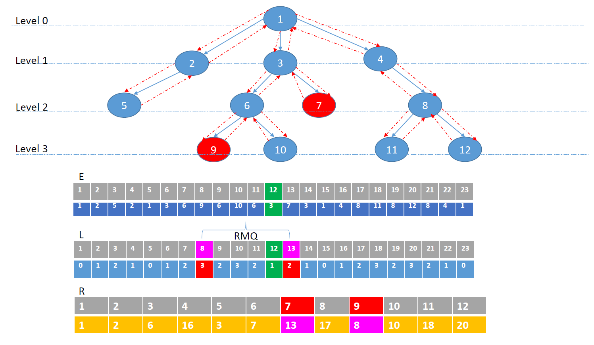

First lets define the terms.

## LCA (Lowest Common Ancestor):Given a pair of nodes , the common ancestor which is farthest from root. See Wikipedia for better explanation.
## RMQ (Range Minimum Query) : Given an array of number , return the index which is minimum between a given pair of indices.

LCP problem can be converted to RMQ problem as following
* Do [Euler Tour!](https://en.wikipedia.org/wiki/Eulerian_path) on the given tree and stores the vertex visisted in an array E. Note that size of this array will be __2n-1__ because every edge has even degree and is visited twice.
* Store level of each vertex during Euler tour in an array L. Note that consecutive entry in this array will differe by +/- 1 [ because the euler path will eithe go down or up and this will only change level either by +1 or -1]. This too will be 2n-1
* Store occurence of first occurence each vertex in E another array R. Size will be n as there are n vertices.

How to find LCA

* First check in array R when these nodes occured during Euler tour traversal, this will be A and B.
* Next you get traversal number, check in array L , the shallow node (the minium level ) going from A to B.
* This will give travesal number , map that in E array. Because if L stores level of that node , E store node number.

Lets see this with an example.

LCA of node n will get converted to RMQ of 2n-1 (L array).

Problem boils down to finding RMQ in L, which can be done in multiple ways.
* Using Table lookup \<O(n^2), O(1)>
* Using Sparse Table (ST) \<O(n log(n)), O(1)>
* Using Segment Tree \<O(n), O(1)>
* \<O(n), O(1)> Algorithm for finding RMQ on Restricted array (contains only +- 1)

Divide array L in block of size log (n) /2. Their will be 2n/log n such blocks  [ n/[log(n)/2] = 2n/log(n)
Convert H array in to H` and further -1 -> 0 and +1 ->1

L = [1,2,3,2,4]
L`= [+1,+1,+1,-1,+1]
L``= [1,1,1,0,1]

Now the trick is to precompute minimum in each block.
For example suppose a block is  00011 , this correspond to a subset of Euler tour i.e. 3 up (where level differe by previous by -1) and 2 down (where level increases).
All possible combination of 00011 between every pair is
s= start index
e= end index 
min = index of minimumum between that pair 
blocksize =5
in-case of tie take right one.

|0|1|2|3|4|
|---|---|---|---|---|
|0|0|0|1|1|

##### P
|s|e|min|
|---|---|---|
|0|0|0|
|0|1|1|
|0|2|2|
|0|3|2|
|0|4|2|
|1|1|1|
|1|2|2|
|1|3|2|
|1|4|2|
|2|2|2|
|2|3|2|
|2|4|2|
|3|3|3|
|3|4|4|
|4|4|4|

so like this store all possible combination for each pattern in H``.
Notice that column are decreasing by 1 in each row i.e. row 0 has 5 entries, row 1 has 4 and so on...which make n*(n+1)/2
5+4+3+2+1 = 15 entries in __P__ array.
Visualize __P__ like below.

||0|1|2|3|4|
|---|---|---|---|---|---|
|0|0|1|2|2|2|
|1|*|1|2|2|2|
|2|*|*|2|2|2|
|3|*|*|*|3|4|
|4|*|*|*|*|4|

#Index in array __P__
By start index: end index will be blocksize.
so (index+1) * blocksize minus unsed (see table above). +1 because we are counting from 0
unsued can be calculated easily index *(index +1)/2
For example if one has find minimum from starting index 3 it would be 

4 * 5 - [3*4/2] = 14 and extra -1 (counting from 0) so answer is 13 , you can verify that 3,4 when stored in 1D will be at 13th index.

By end index: start index will be 0, so straightforward just lookup end_index. 

__Storage__:
Number of block is  2n/log(n)
Each block has n*(n+1)/2 combination
So create a 1-D array __T__ of size 2n/log(n) * [blocksize*(blocksize+1)/2] 
and this array can be index using decimal equivalent of block 
for example 00011 is 3 , and we know in each block  there are 15 combination for each decimal equivalent of block.
So in above example array __P__ is stored from location __45__ (decimal equivalent * blocksize i.e. 3*15)
Note even table __P__ shown as array , we will store this also as 1D array.

So now suppose  you have query what is minimum at 3rd block 2nd index

* Calculate decimal equivalent of 3rd block, multiply with blocksize and reach to index in __T__ , gives 45
* Lookup [2,4](refer indexing section above with start_index on how to find the index ] from that __T__ index, and that gives you minimum, gives 11
so index in __T__ would be __56__ i.e. 45+11

 
 

#### RMQ to LCA
RMQ problem can be converted to generalized RMQ problem by first converting it to LCA problem and then can be solved using above way.
We use cartesian tree to convert RMQ to LCA

What is Cartesian Tree
 A tree that can be build from an array which satisfy
* min-Heap or Max Heap property
* an inorder travesal yield the orignal array.

Reference
1. https://www.topcoder.com/community/data-science/data-science-tutorials/range-minimum-query-and-lowest-common-ancestor/
2. 
